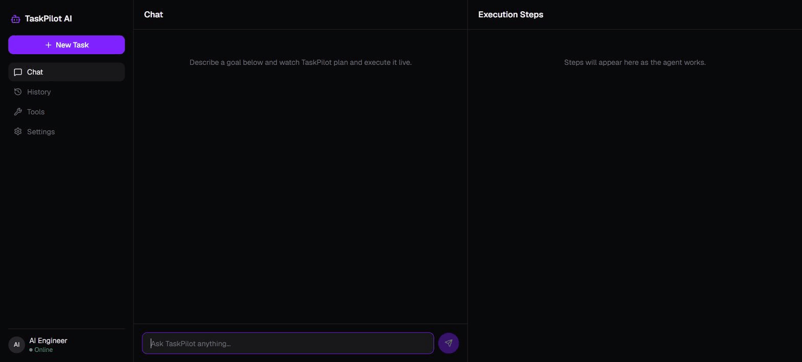

# TaskPilot AI

[](https://github.com/sivasoundhar/taskpilot-ai/actions/workflows/ci.yml)
[](LICENSE)


**An autonomous AI agent that *does* multi-step tasks, not just talks about
them** — you give it a goal in plain English, and it plans the steps, picks
the right real tool for each one (web search, file system, code execution)
via [MCP](https://modelcontextprotocol.io) (Model Context Protocol), executes
them in sequence, and streams every tool choice live so you watch it reason
and act.



*A real, unedited run: "Search USD/INR rate, save rates.json, create
converter.py that imports from a separate utils.py you also write, run it,
save results.csv." All 3 tools, live.*

---

## Table of Contents

- [Why this exists](#why-this-exists)
- [The wow factor: live tool visibility](#the-wow-factor-live-tool-visibility)
- [Features](#features)
- [Architecture](#architecture)
- [Tech stack](#tech-stack)
- [Getting started](#getting-started)
- [Try it](#try-it)
- [API](#api)
- [Project layout](#project-layout)
- [Documentation](#documentation)
- [Known limitations](#known-limitations)
- [License](#license)

---

## Why this exists

Chatbots *tell* you how to do something — you still do the work yourself.
Real tasks usually need several steps and several different tools ("search
for X, analyze it, save the result"), and manually chaining that together is
tedious. TaskPilot AI is built to actually **do** the task: it plans the
steps, picks the right tool for each one, chains real output from one step
into the next, and hands back the finished result — while showing its work
live, not as a black box.

It's a portfolio project built to demonstrate a specific, current skill:
**agentic AI with real tool-use via MCP**, the protocol Anthropic introduced
as the emerging industry standard for connecting AI agents to tools.

## The wow factor: live tool visibility

The single most important feature: every tool the agent uses shows up as a
live step card **the moment it runs**, not all at once at the end. Real
output, from an actual run:

```
You: "Search for the population of India's 5 largest cities, save as
      cities.csv, then calculate each city's percentage share."

Agent: 🧠 Planning... (3 steps identified)

  ┌─────────────────────────────────────────────┐
  │ Step 1: 🔍 Web Search                        │
  │ → Searching "population largest cities India"│
  │ ✓ Done                                       │
  └─────────────────────────────────────────────┘
  ┌─────────────────────────────────────────────┐
  │ Step 2: 📁 File System                       │
  │ → Writing cities.csv...                      │
  │ ✓ Saved to cities.csv                        │
  └─────────────────────────────────────────────┘
  ┌─────────────────────────────────────────────┐
  │ Step 3: 💻 Code Execution                    │
  │ → Reading cities.csv, computing percentages  │
  │ ✓ Done                                       │
  └─────────────────────────────────────────────┘

Agent: "Completed 3/3 steps successfully."
```

You watch the agent pick **tool 1 → 2 → 3**, live, over Server-Sent Events —
proof it's reasoning and acting, not just formatting a canned answer.

## Features

- 🧠 **LangGraph planning loop** — a goal in plain English becomes an
  ordered, tool-assigned plan before any tool runs.
- 🔧 **3 real tools via MCP** — Web Search, File System, Code Execution
  (see [MCP coverage](#mcp-coverage-honestly) below).
- 🔗 **Real multi-step chaining** — a later step gets the *actual* output of
  the step before it (not a paraphrase, not a "saved" confirmation string),
  so "search X, then analyze it" genuinely analyzes what was found.
- 📡 **Live streaming UI** — step cards render one by one as they happen,
  over SSE, not after the whole task finishes.
- 🔁 **Self-correcting retries** — a failed `code_execution` attempt gets up
  to 2 more tries, with the real error fed back into the regeneration
  prompt, visible live as it happens.
- 🛟 **LLM provider fallback** — Groq (fast, free-tier primary)
  transparently falls back to a local Ollama model on any outage/rate limit.
- 🗂️ **Run history** — past tasks persist to SQLite and are browsable in
  the UI.
- ⚙️ **Live-editable settings** — flip LLM provider preference, log level,
  and search result count from the UI, no restart needed.
- ✅ **Tested, not just built** — 129 automated tests plus extensive real
  live-testing (8 real bugs found and fixed that way), and CI running the
  suite on every push.

### MCP coverage, honestly

Web Search and File System are backed by real MCP servers
(`duckduckgo-mcp-server`, `@modelcontextprotocol/server-filesystem`). Code
Execution is a self-built sandboxed subprocess runner, **not** MCP — every
MCP option for running arbitrary code had a real, disqualifying problem when
checked (the leading candidate, `mcp-run-python`, is archived with two
unpatched CVEs). This is the documented fallback the project's own spec
allows for exactly this situation, used deliberately and written up in full
in [`docs/MCP_NOTES.md`](docs/MCP_NOTES.md) — not silently substituted.

## Architecture

```
 User goal (plain English)
        │
        ▼
 POST /run (FastAPI, SSE)
        │
        ▼
 Plan (LangGraph)  →  Execute step 1..n  →  chain results  →  stream updates
        │                    │
        │           ┌────────┼────────┐
        │           ▼        ▼        ▼
        │      🔍 Web    📁 File   💻 Code
        │       Search   System   Execution
        │      (MCP)      (MCP)   (sandboxed)
        ▼
 Live step cards (React) → final result
```

Full component breakdown, request lifecycle, state management, error
handling, and the `code_execution` sandbox's trust model:
[`docs/ARCHITECTURE.md`](docs/ARCHITECTURE.md).

## Tech stack

| Layer | Technology |
|---|---|
| Agent framework | LangGraph + LangChain |
| Tool protocol | MCP (Model Context Protocol) |
| LLM | Groq (primary, free tier) + local Ollama (automatic fallback) |
| Backend | FastAPI + Uvicorn |
| Streaming | Server-Sent Events (`sse-starlette`) |
| Frontend | React 18 + TypeScript + Vite |
| Styling | Tailwind + shadcn/ui (Radix primitives) |
| Storage | SQLite (run history) |
| Config | Pydantic Settings + python-dotenv |
| Testing | pytest + pytest-asyncio |
| CI | GitHub Actions (backend pytest + frontend lint/build) |
| Containerization | Docker + docker-compose (local dev) |

No live deployed URL by design — Docker productionizing + a hosted
deployment were deliberately dropped from scope in favor of CI-only, so the
project stays run-locally-first and free to demo without a paid host. The
`Dockerfile`/`docker-compose.yml` still work for local dev — see
[Docker](#docker) below.

129 automated tests passing (`pytest -k "not live"`), CI green on every push.

## Getting started

### Prerequisites

- **Python 3.11+** (pinned in `.python-version`, matches the Docker image)
- **Node.js** (bundles `npm`/`npx` — needed for both the frontend and the
  File System MCP server)
- A free **[Groq](https://console.groq.com)** API key (primary LLM)
- *Optional:* [Ollama](https://ollama.com) running locally, for the offline
  LLM fallback (`ollama pull llama3.1` after installing)
- *Optional:* a free **[Tavily](https://tavily.com)** API key, for a search
  backend purpose-built for LLM agents instead of the key-free DuckDuckGo
  default

### Configuration

Copy `.env.example` to `.env` and fill in what you need — everything has a
sane default except `GROQ_API_KEY`:

| Variable | Default | Notes |
|---|---|---|
| `GROQ_API_KEY` | *(required)* | Get one free at [console.groq.com](https://console.groq.com) |
| `GROQ_MODEL` | `openai/gpt-oss-120b` | Groq's current recommended general model |
| `OLLAMA_BASE_URL` | `http://localhost:11434` | Only used if Groq fails |
| `OLLAMA_MODEL` | `llama3.1` | Must be pulled locally first (`ollama pull llama3.1`) |
| `APP_ENV` | `development` | |
| `LOG_LEVEL` | `INFO` | |
| `CORS_ORIGINS` | `http://localhost:5173,http://localhost:3000` | Comma-separated |
| `FILES_SANDBOX_DIR` | `./workspace` | Every file read/write is confined here — no arbitrary file access |
| `TAVILY_API_KEY` | *(blank)* | Leave blank to run entirely key-free (DuckDuckGo fallback) |

### Backend

```bash
python -m venv .venv
.venv\Scripts\activate        # Windows — use `source .venv/bin/activate` on macOS/Linux
pip install -r requirements.txt
pip install uv                # gives `uv`/`uvx`, which spawns the Web Search MCP server
cp .env.example .env          # then fill in GROQ_API_KEY
uvicorn src.main:app --reload
```

`npx` (bundled with Node.js) spawns the File System MCP server the same way
`uvx` spawns Web Search's — no separate install step beyond having Node.js
on `PATH`.

Check it's up: visit **http://localhost:8000/health** — should return
`{"status": "ok", "env": "development"}`.

### Frontend

Run alongside the backend above — Vite's dev server proxies `/run`,
`/health`, `/history`, and `/settings` to `http://127.0.0.1:8000`.

```bash
cd frontend
npm install
npm run dev
```

Open **http://localhost:5173**, type a goal, and watch it plan and execute
live.

### Docker

An alternative to the manual backend setup above — everything (Python,
Node.js, `uv`) is baked into the image:

```bash
docker compose up --build
```

Serves the API on `http://localhost:8000`; `./workspace` is mounted into the
container so files the agent creates are visible on the host.

### Tests

```bash
pytest                     # everything, including live tests (needs GROQ_API_KEY, network)
pytest -k "not live"       # what CI runs — fakes only, no network/API key needed
```

## Try it

Type a goal into the UI and watch it work. A few to start with:

- *"Search the latest AI news, summarize the top 3, save to report.txt"*
- *"Calculate compound interest on 5000 at 4% for 6 years and save the
  result"*
- *"Search USD/INR rate, save rates.json, create converter.py that imports
  from a separate utils.py you also write, run it, save results.csv"*

## API

Full reference — every endpoint, all 4 SSE event types `POST /run` emits,
request/response JSON — in [`docs/API.md`](docs/API.md). Quick shape:

| Method | Path | Purpose |
|---|---|---|
| `GET` | `/health` | Liveness check |
| `POST` | `/run` | Run the agent on a goal, streaming progress over SSE |
| `GET` | `/history` | Past completed runs |
| `GET` | `/settings` | Current config + live-editable knobs |
| `PATCH` | `/settings` | Update LLM provider preference / log level / search result count |

## Project layout

```
src/
├── main.py               # FastAPI app: /health, POST /run (SSE), /history, /settings
├── config.py              # Pydantic Settings (env-driven config)
├── models.py                # Shared request/response schemas
├── storage.py                 # SQLite run-history store (History nav page)
├── runtime_settings.py          # In-memory, live-editable settings (no restart needed)
├── agent/
│   ├── planner.py         # goal -> ordered, tool-assigned plan (LLM); check_intent() gates chit-chat
│   ├── executor.py          # runs one step / the whole plan, chains results, retries code_execution
│   ├── graph.py                # planner + executor as one LangGraph graph
│   ├── state.py                  # AgentState schema
│   └── llm_provider.py             # Groq (primary) + Ollama (fallback) resilient LLM wrapper
├── tools/
│   ├── mcp_client.py       # generic MCP stdio connection manager
│   ├── web_search.py         # Tavily / DuckDuckGo MCP server wrapper
│   ├── file_system.py          # filesystem MCP server wrapper (sandboxed)
│   └── code_execution.py         # sandboxed subprocess (no MCP — see docs/MCP_NOTES.md)
└── utils/
    └── streaming.py           # SSE event formatting helpers

frontend/src/
├── pages/
│   ├── AgentPage.tsx          # sidebar nav + whichever view is active
│   ├── HistoryPage.tsx          # past completed tasks
│   ├── ToolsPage.tsx              # static info on the 3 tools
│   └── SettingsPage.tsx             # live backend settings view
├── components/
│   ├── Sidebar.tsx              # brand, New Task, nav, active-task summary
│   ├── ChatPanel.tsx              # message bubbles + TaskInput
│   ├── TaskInput.tsx
│   ├── StepCard.tsx                 # ⭐ one tool-use card (the wow factor)
│   ├── StepList.tsx                   # numbered/connected step timeline
│   ├── ExecutionPanel.tsx               # StepList + ResultDisplay
│   └── ResultDisplay.tsx                  # final banner + file preview
├── hooks/useAgentRun.ts       # drives one POST /run session's state
├── services/api.ts            # streamRun() -- hand-parsed SSE over fetch()
└── types/index.ts             # mirrors src/models.py

tests/                  # pytest — unit + fake-based integration + a few live smoke tests
docs/                    # see Documentation below
.github/workflows/ci.yml  # backend pytest + frontend lint/build, on every push/PR
```

## Documentation

| Doc | What's in it |
|---|---|
| [`docs/ARCHITECTURE.md`](docs/ARCHITECTURE.md) | Component breakdown, request lifecycle, state management, error handling, sandbox trust model |
| [`docs/API.md`](docs/API.md) | Every endpoint, all SSE event types, real request/response examples |
| [`docs/MCP_NOTES.md`](docs/MCP_NOTES.md) | Which MCP servers are used, why, and the one deliberate non-MCP fallback |

## Known limitations

Stated plainly rather than glossed over (full detail in `docs/ARCHITECTURE.md`):

- **`code_execution` has only Python's standard library** — no pygame,
  numpy, requests, matplotlib, etc. A goal needing one gets routed to
  `file_system`-only (the code gets written, not run).
- **Interactive programs can't be "run and confirmed"** — the sandboxed
  subprocess has no stdin, so a game needing live keyboard input can be
  written but not played and verified by the agent.
- **Not a hardened OS-level sandbox** — `code_execution` uses AST-level
  denylists and process isolation, not seccomp/containers/WASM. Fine for
  this project's actual threat model (the agent's own LLM-generated code,
  not untrusted third-party input) — stated honestly in the code's own
  docstring, not overclaimed.
- **Ollama as a primary planner is unreliable** on complex multi-step tasks
  — it does its actual job well (an offline fallback during a Groq outage),
  just isn't recommended as the default driver.
- **No live deployed URL** — a deliberate scope decision; run it
  locally (see [Getting started](#getting-started)) or with Docker.

## License

[MIT](LICENSE) © 2026 Siva
